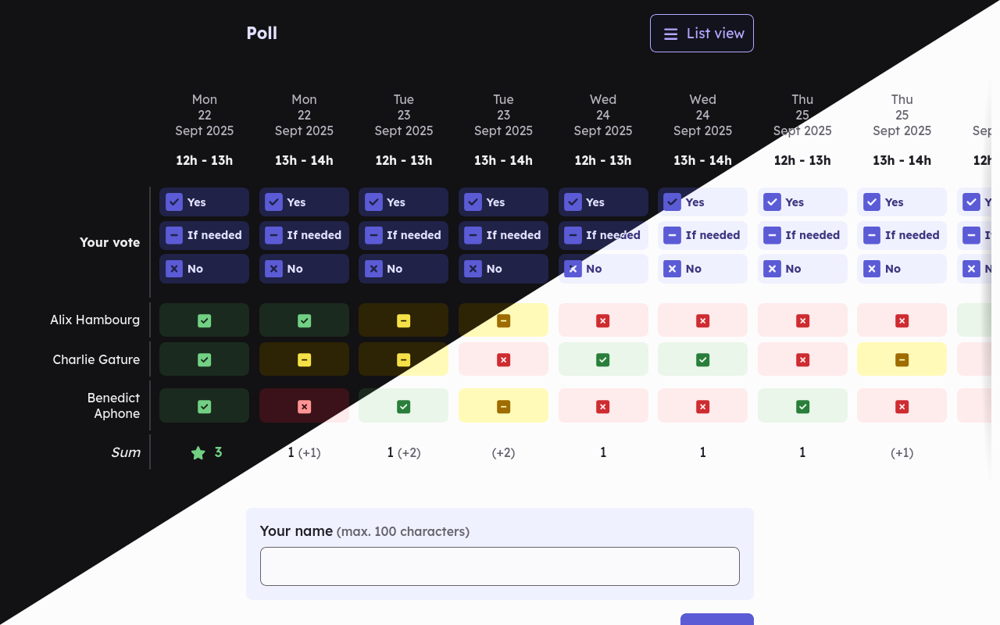

# Pollaris

**Pollaris is a polling tool to plan, organise and make decisions quickly, easily and without registration.**

Pollaris is licensed under [GNU Affero General Public License v3.0 or later](https://framagit.org/pollaris/pollaris/-/blob/main/LICENSE.txt).

## Documentation

- [The Administrators' Guide](/docs/administrators/README.md)
- [The Developers' Guide](/docs/developers/README.md)

## Credits

Pollaris relies on a bunch of other projects:

- [Composer](https://getcomposer.org/)
- [Doctrine](https://www.doctrine-project.org/)
- [Foundry](https://symfony.com/bundles/ZenstruckFoundryBundle/current/index.html)
- [esbuild](https://esbuild.github.io/)
- [PHP](https://www.php.net/)
- [PHP\_CodeSniffer](https://github.com/squizlabs/PHP_CodeSniffer)
- [PHPStan](https://phpstan.org/)
- [PHPUnit](https://phpunit.de/)
- [Rector](https://getrector.com/)
- [Stimulus](https://stimulus.hotwired.dev/)
- [Symfony](https://symfony.com/)
- [Turbo](https://turbo.hotwired.dev/)

Thanks to their authors!
